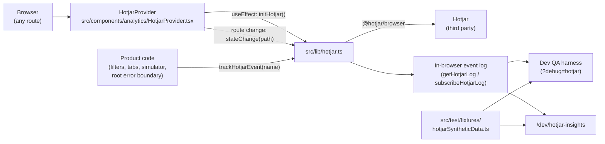

# Hotjar Behavioural Telemetry

How Ellyra Pulse sends behavioural telemetry (session recordings, heatmaps, custom events) to
[Hotjar](https://www.hotjar.com), how sensitive DOM content is kept out of it, and how to use the
dev-only QA harness and insights dashboard built on top of it.

> **Read [`docs/PRIVACY_HOTJAR_DPIA.md`](PRIVACY_HOTJAR_DPIA.md) before enabling this anywhere
> real users or real patient feedback are present.** Hotjar does not sign a HIPAA Business
> Associate Agreement, and `docs/DESIGN_UI.md` §9.3 requires sensitive values to be excluded from
> replay tools. The integration below is engineered to minimise what Hotjar can see, but whether
> it may run at all on a given surface is a privacy decision recorded in that document, not a
> technical one.

---

## 1. Architecture at a glance



Hotjar telemetry is entirely browser-side. It never passes through the backend ingestion
pipeline (`src/backend/`), the warehouse, or the realtime stream, and nothing from Hotjar is read
back into the app. The insights dashboard is computed from **synthetic fixtures**, not from
Hotjar's API.

| File | Role |
|---|---|
| `src/lib/hotjar.ts` | The only module that talks to `@hotjar/browser`. SSR-safe wrapper + local event log. |
| `src/components/analytics/HotjarProvider.tsx` | Mounted in `src/routes/__root.tsx`. Initialises Hotjar after hydration, reports SPA route changes, lazy-mounts the harness. |
| `src/components/dev/HotjarTestHarness.tsx` | Dev-only floating QA widget. |
| `src/components/analytics/HotjarMetricsDashboard.tsx` | Dev-only insights dashboard UI. |
| `src/components/analytics/hotjarMetrics.ts` | Pure metric functions (KPIs, funnel, drop-off, click distribution, cohort filters). |
| `src/routes/dev/hotjar-insights.tsx` | Guarded route for the dashboard. |
| `src/test/fixtures/hotjarSyntheticData.ts` | Deterministic synthetic persona/session generator. |
| `src/test/hotjar.test.ts` | Unit tests for fixtures, metrics and the wrapper. |
| `src/vite-env.d.ts` | Types for the `VITE_HOTJAR_*` env vars. |

---

## 2. Configuration

This is a Vite / TanStack Start app, so client-exposed variables use the `VITE_` prefix (a
`NEXT_PUBLIC_*` variable would never reach the browser). Values are inlined into the client
bundle **at build time** — changing them requires a rebuild, not a restart.

| Variable | Default | Effect |
|---|---|---|
| `VITE_HOTJAR_SITE_ID` | unset | Hotjar site ID. **If unset or invalid, Hotjar never loads**; every wrapper call becomes a local-log-only no-op. |
| `VITE_HOTJAR_VERSION` | `6` | Hotjar snippet version. |
| `VITE_ENABLE_HOTJAR_DEBUG` | unset | `true` enables Hotjar's console debug logging **and compiles the dev tooling (harness + `/dev/hotjar-insights`) into non-dev builds**. Must be unset or `false` for production builds. |

Set them in `.env` / `.env.local` (both gitignored) — see `.env.example`. `.env.local` overrides
`.env`; process environment variables override both, which is how to force a value for a single
build:

```sh
VITE_ENABLE_HOTJAR_DEBUG=false npm run build
```

Hotjar only executes when **all** of these hold: running in a browser (`typeof window !==
'undefined'`), `VITE_HOTJAR_SITE_ID` is a positive integer, and the root component has hydrated.
Server-side rendering never touches Hotjar.

---

## 3. Client API (`src/lib/hotjar.ts`)

| Function | Behaviour |
|---|---|
| `initHotjar()` | Idempotent. Calls `Hotjar.init(siteId, version, { debug })`. Returns `false` on the server or when unconfigured. |
| `identifyUser(userIdHash, attributes)` | Associates a **hashed** user ID and sanitised attributes with the session. |
| `trackHotjarEvent(eventName)` | `Hotjar.event(eventName)`. |
| `resetHotjarUser()` | `window.hj('identify', null, {})` — call on logout so the next session isn't attributed to the previous user. |
| `trackHotjarStateChange(path)` | `Hotjar.stateChange(path)` for SPA navigations (called by the provider; you shouldn't need to). |
| `sanitizeHotjarAttributes(attrs)` | Exposed for tests; used internally by `identifyUser`. |
| `getHotjarQueueStatus()` | `window.hj` presence and `window.hj.q` stub-queue length, for the harness. |
| `getHotjarLog()` / `subscribeHotjarLog()` / `clearHotjarLog()` | In-browser ring buffer (200 entries) of every command, flagged `sent` or `local`. |

Every call is recorded in the local log even when Hotjar is disabled, so the harness and
dashboard work without a site ID.

### 3.1 Identify-attribute rules

Hotjar's Identify API only accepts a flat map of `string | number | boolean | Date`, and every
attribute is visible to anyone with access to the Hotjar account. `sanitizeHotjarAttributes`
therefore **drops**:

- any non-primitive value (objects, arrays, `null`, `undefined`, `NaN`, invalid `Date`);
- any key matching `/e-?mail|name|phone|address|dob|birth|ssn|nhs|mrn|ip_?addr|token|secret|password/i`.

The key filter is a safety net, not a licence: **only send attributes from this allowlist**:

| Attribute | Example | Notes |
|---|---|---|
| `account_tier` | `"pro"` | |
| `user_role` | `"operator"` | |
| `device` | `"desktop"` | |
| `synthetic` | `true` | Set by the QA harness so synthetic personas are filterable in Hotjar. |

The `userIdHash` must be a one-way hash or random surrogate — never a raw user ID, email, NHS
number, or anything reversible. Adding a new attribute requires updating this table and the
privacy record.

> **Not wired yet:** the frontend has no login/logout flow, so `identifyUser` and
> `resetHotjarUser` are currently only called from the QA harness. When auth lands, call
> `resetHotjarUser()` in the logout handler *before* clearing the session.

---

## 4. Event catalogue

Event names are **fixed, code-defined strings**. Never interpolate user input, verbatim text,
response/session IDs, or filter *values* into an event name (`docs/DESIGN_UI.md` §8 rule 9).

| Event | Fired from | When |
|---|---|---|
| `filter_applied` | `src/routes/index.tsx` | A feature, aspect, or quadrant theme filter is selected (not when cleared). |
| `dashboard_tab_scorecard_viewed` / `_rootcause_` / `_verbatims_` / `_simulator_` | `src/routes/index.tsx` | Tab switch. The suffix comes from the four fixed tab values, never from user input. |
| `simulator_pipeline_run` | `src/components/nps/Simulator.tsx` | "Run pipeline" clicked. The input text is **not** sent. |
| `error_boundary_tripped` | `src/routes/__root.tsx` | Root error component renders. The error message is **not** sent. |
| `telemetry_export_initiated` | QA harness only | Reserved for a future export feature. |

SPA route changes are reported via `stateChange(pathname)` — pathname only, never the query
string (which could carry filter values).

---

## 5. DOM privacy masking (`data-hj-suppress`)

Hotjar records the rendered DOM. Elements carrying `data-hj-suppress` (and all their
descendants) are replaced with redaction blocks in recordings and heatmaps. Hotjar also masks
form-input keystrokes by default, but we suppress sensitive inputs explicitly anyway.

**Currently suppressed:**

| Location | What |
|---|---|
| `VerbatimHub.tsx` — list card | Redacted verbatim text |
| `VerbatimHub.tsx` — detail dialog | Redacted verbatim text |
| `VerbatimHub.tsx` — detail dialog | Session telemetry grid (session ID, model version, device, …) |
| `Simulator.tsx` | Free-text input `<textarea>` (pre-redaction) |
| `Simulator.tsx` | "stored:" redacted output |
| `HotjarTestHarness.tsx` | Masking test zone (synthetic secrets) |
| `HotjarMetricsDashboard.tsx` | Session drawer "session context" (synthetic IP / key / email) |

Redacted verbatims are still suppressed: they are health narratives even after PHI tags are
applied, and redaction is not guaranteed complete (see the README's name-redaction caveat).

### 5.1 Review checklist for new UI

Add `data-hj-suppress` to the **smallest container** that renders any of:

- [ ] verbatim / free-text feedback, redacted or not;
- [ ] session IDs, response IDs that map to a person, model-run IDs tied to a user;
- [ ] email addresses, names, phone numbers, NHS numbers, MRNs, DOBs, addresses;
- [ ] API keys, tokens, secrets, connection strings, internal IPs or hostnames;
- [ ] raw telemetry payloads or error messages that may echo user input;
- [ ] any free-text `<input>` / `<textarea>` a user types health information into.

Then verify in the QA harness masking zone or a real Hotjar recording.

---

## 6. Dev tooling and production builds

Both dev surfaces are compiled in only when
`import.meta.env.DEV || import.meta.env.VITE_ENABLE_HOTJAR_DEBUG === "true"`. That expression is
**inlined at each guard site** (not imported) so the bundler constant-folds it and drops the
dynamic `import()` entirely.

| Build | Harness | `/dev/hotjar-insights` |
|---|---|---|
| `npm run dev` | Always mounted (collapsed, bottom-right) | Available |
| Build with `VITE_ENABLE_HOTJAR_DEBUG=true` | Lazy chunk, loaded only with `?debug=hotjar` | Available (lazy chunk) |
| Build with it unset/`false` (**production**) | Not in bundle | Route returns 404; dashboard not in bundle |

The route file itself always exists (TanStack's route tree is static), so the URL resolves to a
404 rather than disappearing; it also sends `noindex, nofollow`.

**Verifying a production build:**

```sh
VITE_ENABLE_HOTJAR_DEBUG=false npm run build
for s in "Hotjar QA harness" "Session replay simulator" "sk_live_synth" "generateSyntheticHotjarUsers"; do
  echo "$s: $(rg -l -F "$s" .output | wc -l)"   # every count must be 0
done
```

---

## 7. QA harness (`HotjarTestHarness`)

A collapsible panel in the bottom-right corner. Header badge: **LIVE** (initialised), **PENDING**
(configured, not yet initialised), **LOCAL ONLY** (no site ID).

- **Status grid** — site ID, debug flag, `window.hj` presence, `window.hj.q` queue length
  ("no stub queue" once Hotjar's script has taken over), current identified persona.
- **User persona simulator** — pick one of 12 synthetic personas; `identifyUser()` sends its
  hash plus the allowlisted attributes; `resetHotjarUser()` clears it.
- **Event dispatcher** — fires `filter_applied`, `telemetry_export_initiated`,
  `error_boundary_tripped`; the log beneath shows each command as `sent` or `local`.
- **Privacy masking test zone** — public values on the left, a `data-hj-suppress` block of
  synthetic secrets on the right. In a Hotjar recording the right column must appear redacted.

---

## 8. Insights dashboard (`/dev/hotjar-insights`)

Visualises Hotjar-style metrics computed from the synthetic fixtures (sample size 50 / 250 /
1000). Everything is client-side and deterministic.

- **Cohort filter bar** — account tier, role, device, has-frustration-signals; applies to every
  widget.
- **KPI cards** — total sessions, average duration, global funnel conversion (sessions reaching
  `export_completed`), frustration index (% sessions with rage clicks or JS errors; red at ≥25%).
- **Funnel** — Session Start → Dashboard View → Filter Applied → Telemetry Exported, with
  overall %, step conversion %, and drop-off count. Clicking a drop-off filters the session table
  to users who reached the previous step but not that one.
- **Session replay simulator** — table of sessions with frustration badges; click a row for a
  side drawer with a chronological timeline of lifecycle events and interactions.
- **Click & dead-click distribution** — top 10 targets; amber ≥15% dead clicks, red ≥30%.
- **Local event stream** — live view of the in-browser Hotjar command log.

Metric definitions live in `src/components/analytics/hotjarMetrics.ts`.

---

## 9. Synthetic data (`src/test/fixtures/hotjarSyntheticData.ts`)

`generateSyntheticHotjarUsers(count = 50, { seed })` returns personas with `userIdHash`
(UUID-shaped, FNV-1a + murmur3 finaliser), `account_tier`, `user_role`, `device`,
`sessionDurationSec` (30–900, right-skewed), `frustrationSignals`, an ordered `events` lifecycle
trace, `interactions` (clicks, dead/rage clicks, U-turns, JS errors — counts always match
`frustrationSignals`), and `maskedContext` (synthetic `10.0.x.x` IP, `sk_live_synth_…` key,
`@example.test` email).

- **Deterministic and prefix-stable:** user *i* is identical whatever `count` is, for a given
  seed (default `1058676`).
- **Correlated, not uniform:** mobile users rage/dead-click more and export less; viewers apply
  fewer filters; JS errors sharply raise export failure; certain targets (`card.kpi-nps`,
  `legend.quadrant-toggle`) are dead-click hotspots — so the dashboard has real patterns to find.
- `SYNTHETIC_MASKING_PAYLOADS` holds static fake secrets for masking tests.
- Nothing here is real data. Never send fixture data to a production Hotjar site except via the
  harness, where personas are tagged `synthetic: true`.

---

## 10. Testing

```sh
npx vitest run src/test      # 13 tests: fixtures, metrics, attribute sanitisation, SSR no-op
```

Manual checks are in `docs/QA_AUTOMATION_GUIDE.md` ("P0 — behavioural telemetry never captures
PHI" and "P1 — dev tooling excluded from production builds").
