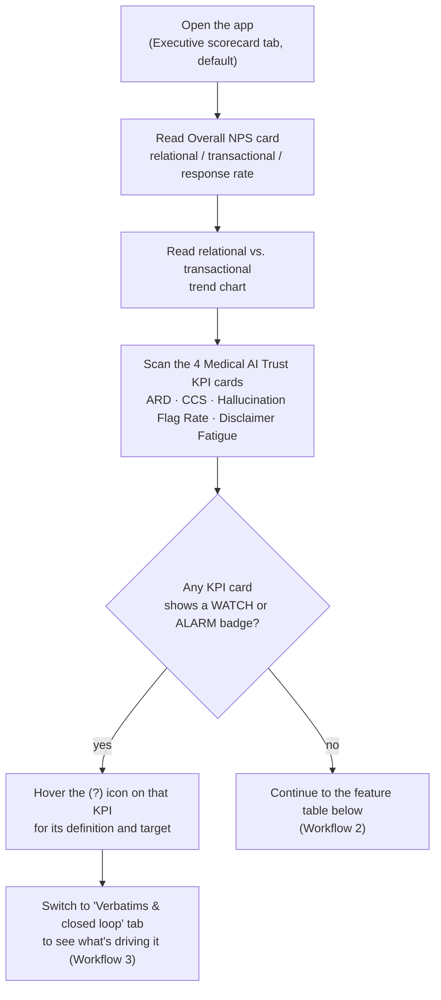
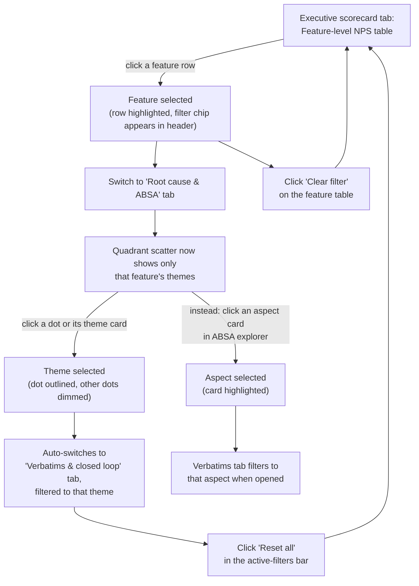
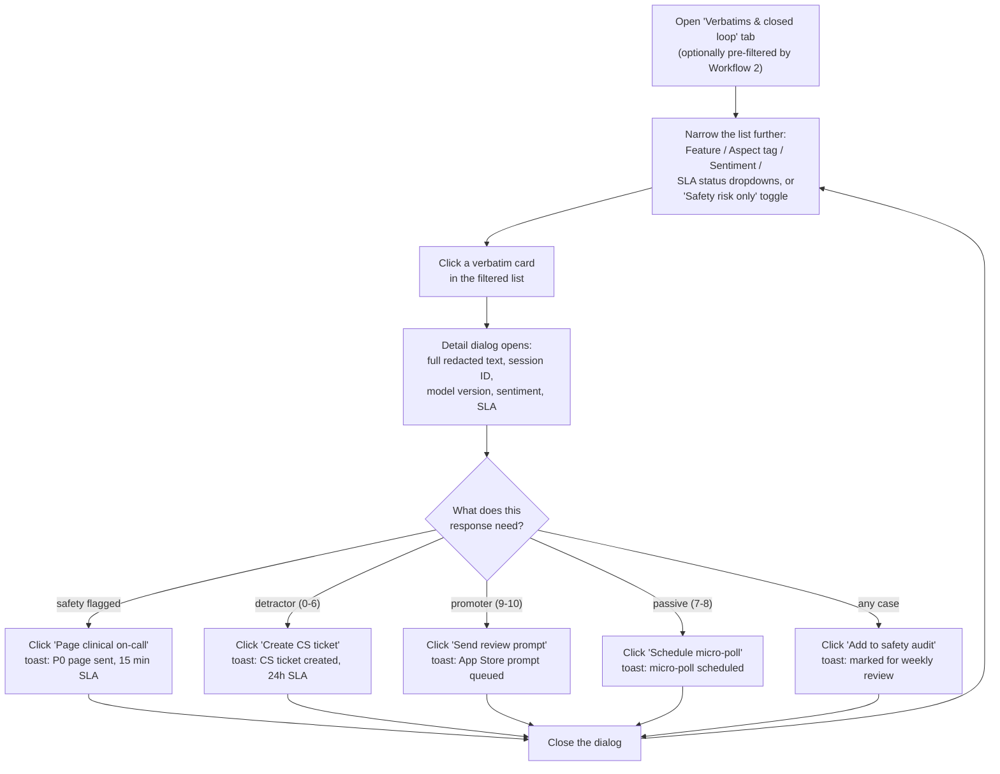
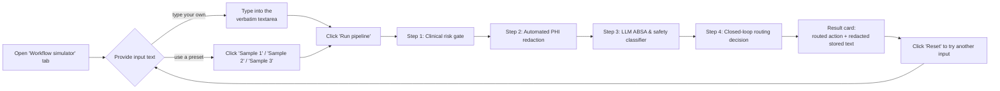

# How to Use Ellyra Pulse

A walkthrough of every workflow implemented in the dashboard UI (`src/routes/index.tsx` and
`src/components/nps/*`), with the exact clicks each one takes. See `README.md` for how to start
the app and `docs/QA_AUTOMATION_GUIDE.md` for the backend API surface.

> **Current state:** the UI you'll read about here renders from the prototype's mock dataset
> (`src/lib/nps-data.ts`), not yet from the live backend in `src/backend/`. Every closed-loop
> action (paging, ticket creation, review prompts) shows a confirmation toast but doesn't persist
> anywhere yet — see README's "Known gaps" section. The workflows and UI steps below are exactly
> what's implemented today.

The app has four tabs, each its own workflow. Three of them (Scorecard, Root Cause & ABSA,
Verbatims) share a single set of filters, so a selection made in one tab narrows what you see in
another — that cross-tab linkage is workflow 2 below.

---

## Workflow 1 — Monitor the executive scorecard

**Tab:** *Executive scorecard*. This is where you start a session: headline NPS, trend, and the
four medical-AI trust KPIs that a generic NPS score can't show.

**Steps:**
1. Open the app — it lands on the **Executive scorecard** tab.
2. Read the **Overall NPS** card (top left): the headline score, month-over-month delta, and the
   Relational / Transactional / Response rate breakdown underneath it. Hover any **(?)** icon for
   a plain-language definition of that metric.
3. Read the **Relational vs. transactional trend** chart (top right) for the 7-month trend line.
4. Scan the four **Medical AI trust KPI** cards below: Anxiety Reduction Delta (ARD), Clinical
   Comprehension Score (CCS), Hallucination / Inaccuracy Flag Rate, and Disclaimer Fatigue Index.
   A card shows a **WATCH** or **ALARM** badge when it's off target — hover its **(?)** icon for
   the target threshold.
5. If a KPI is flagged, jump to the **Verbatims & closed loop** tab (Workflow 3) to read what
   users are actually saying that's driving it.

---

## Workflow 2 — Drill down: feature → root cause → aspect

This is the cross-tab filtering workflow. A selection made in any one of these three places
narrows what the other two (and the Verbatims tab) show — it's how you go from "something is
wrong" to "here's the specific complaint."

**Steps:**
1. On the **Executive scorecard** tab, scroll to the **Feature-level transactional NPS** table.
   Click any row (e.g. "MRI / Imaging Insights") to filter the whole dashboard to that feature —
   the row highlights and a filter chip appears in the page header. Click the row again, or the
   table's **Clear filter** button, to remove it.
2. Switch to the **Root cause & ABSA** tab. The **root-cause quadrant** scatter plot (feedback
   volume vs. impact on net sentiment) is now scoped to your selected feature, if any.
3. Click a dot on the chart, or the matching card in the theme list below it, to select a theme —
   this **automatically switches you to the Verbatims & closed loop tab**, already filtered to
   that theme. Click the dot/card again, or **Clear theme filter**, to undo it.
4. Alternatively, on the same tab, use the **ABSA explorer** below the quadrant chart: click an
   aspect card (e.g. "Tone & bedside manner") to filter by that aspect instead. Click it again,
   or **Clear aspect filter**, to remove it.
5. At any point, a banner above the tabs lists your **active filters** as chips; click **Reset
   all** to clear feature, aspect, and theme selections at once.

---

## Workflow 3 — Review a verbatim and close the loop

**Tab:** *Verbatims & closed loop*. This is the operational workflow: find a specific response,
read its full context, and take the action its routing decision calls for.

**Steps:**
1. Open the **Verbatims & closed loop** tab. If you arrived here via Workflow 2, it's already
   filtered by feature/aspect/theme — you'll see a read-only **Theme: …** chip if so.
2. Narrow further with the filter bar: **Feature**, **Aspect tag**, **Sentiment**
   (all/positive/negative), and **SLA status** (all/Open/Contacted/Resolved/Escalated) dropdowns,
   plus the **Safety risk only** toggle (highlights red when active) to see only safety-flagged
   responses. The two stat tiles above the filters (**Time to First Contact**, **Close rate**)
   summarize the currently filtered set.
3. Click any verbatim card in the list to open its detail dialog — full redacted text, session
   telemetry (session ID, model version, device, survey type), sentiment score, and SLA status.
4. Inside the dialog, the available action button depends on the response's routing tier:
   - **Page clinical on-call** — shown when the response is safety-flagged.
   - **Create CS ticket** — shown for detractors (score 0–6).
   - **Send review prompt** — shown for promoters (score 9–10).
   - **Schedule micro-poll** — shown for passives (score 7–8).
   - **Add to safety audit** — always available, regardless of tier.

   Clicking any of these shows a confirmation toast describing the (simulated) action taken.
5. Close the dialog and repeat from step 2 for the next response.

---

## Workflow 4 — Test the pipeline in the sandbox simulator

**Tab:** *Workflow simulator*. Lets you see exactly how a piece of feedback text would be
redacted, classified, and routed — without it going anywhere real. This mirrors the backend's
`POST /api/v1/workflow/simulate` endpoint, run locally in the browser for the demo.

**Steps:**
1. Open the **Workflow simulator** tab.
2. Provide input text either by typing directly into the verbatim textarea, or by clicking one
   of the three **Sample 1 / Sample 2 / Sample 3** buttons to load a preset example.
3. Click **Run pipeline**. The four stages animate in sequence, each showing its own result as it
   completes:
   - **Clinical risk gate** — flags acute-risk language.
   - **Automated PHI redaction** — shows the redaction count.
   - **LLM ABSA & safety classifier** — shows the sentiment score and aspect tags.
   - **Closed-loop routing decision** — shows the final routing action.
4. Read the result card: the routed action (e.g. "P0 Clinical On-Call Page," "CS Ticket,"
   "Review Conversion Prompt," "In-session Micro-poll") and the redacted version of your input
   text.
5. Click **Reset** to clear the result and try a different input.

---

## Quick reference: which tab for which question

| You want to... | Go to |
|---|---|
| Check the current headline NPS and trust KPIs | Executive scorecard |
| Find out which feature is dragging the score down | Executive scorecard → feature table |
| Find out *why* — which theme or aspect is the driver | Root cause & ABSA |
| Read what a specific user actually said | Verbatims & closed loop |
| Take action on a detractor, safety flag, or promoter | Verbatims & closed loop → open a card |
| See how a new piece of feedback would be handled, without it being real | Workflow simulator |
