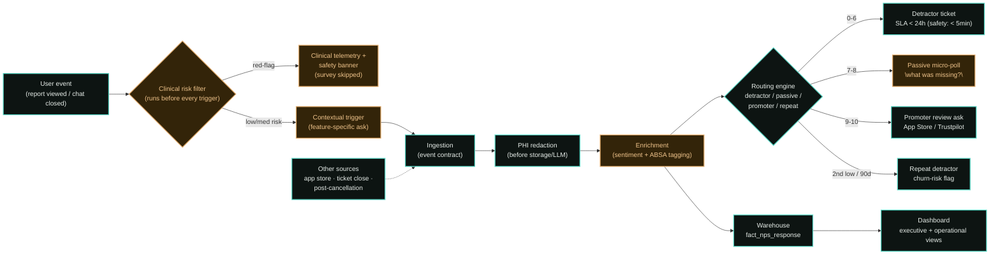

# End-to-End Workflow

How a single user interaction becomes a routed, auditable NPS/sentiment record — from the
moment a user finishes a session in the Ellyra app to the ticket or in-app action that follows.
This is the same pipeline implemented in `src/backend/ingestion/` and specified in
`docs/DESIGN.md` §3–§4 and `docs/DESIGN_UI.md` §9–§10.

## Stage-by-stage

1. **User event.** A session ends at a point that maps to one feature — a lab report finishes
   summarizing, a symptom chat thread closes. This is the trigger candidate, not yet a survey.

2. **Clinical risk filter (gate).** Before any survey fires, the session is scored against the
   same acute-risk signal used for in-session safety monitoring. This runs unconditionally,
   ahead of every other branch — see `docs/DESIGN.md` §3.
   - **Red-flag** → the session is diverted straight to clinical telemetry, and the in-product
     emergency-helpline banner may fire (`docs/DESIGN.md` §8). No survey is shown.
   - **Low/medium risk** → proceeds to the contextual trigger.

3. **Contextual trigger.** A feature-specific question — e.g. *"How confident do you feel
   discussing this report with your doctor?"* for the lab parser — rather than a generic NPS ask
   (`docs/DESIGN.md` §2).

4. **Ingestion.** The response normalizes into one event contract regardless of source. Other
   channels (app store reviews, post-ticket CSAT, post-cancellation surveys) feed the same
   ingestion step directly, bypassing the trigger stages above.

5. **PHI redaction.** Deterministic pattern redaction runs before the text touches any
   analytics store or model call (`src/backend/ingestion/redaction.ts`), followed by a leakage
   verification pass. A record that fails leakage verification is quarantined here and never
   reaches classification.

6. **Enrichment.** Sentiment scoring and ABSA tagging (`clinical_trust`,
   `tone_and_bedside_manner`, `document_parsing_ocr`, `actionability`, plus operational aspects)
   run on the redacted text only (`src/backend/ingestion/absa.ts`).

7. **Routing engine.** Deterministic rules, safety evaluated ahead of NPS tier
   (`src/backend/ingestion/routing.ts`):
   - **0–6 (detractor)** → CS ticket, 24h SLA (15 min if safety-flagged).
   - **7–8 (passive)** → in-session micro-poll, no ticket created.
   - **9–10 (promoter)** → review-request prompt, subject to eligibility checks.
   - **Second low score within 90 days** → account flagged churn-risk, further surveys
     suppressed.

8. **Warehouse.** Every response persists to `fact_nps_response` regardless of route, carrying
   the feature, aspects, sentiment, and routing outcome (`db/migrations/0001_init.sql`).

9. **Dashboard.** The executive and operational views (`docs/DESIGN_UI.md` §2) read from the
   warehouse — never from raw or in-flight session data.

## Legend

| Style | Meaning |
|---|---|
| Amber | New or updated in the synthesis merge described in `docs/DESIGN_COMPARISON.md` |
| Teal | Carried over from the original pipeline design |
